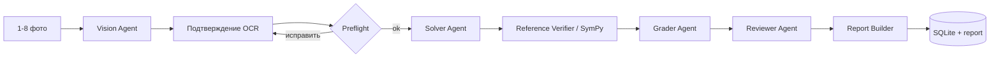
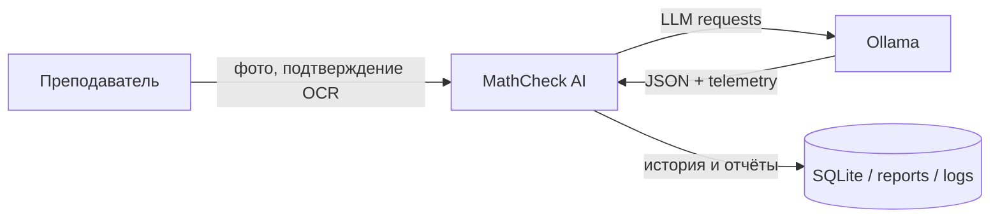
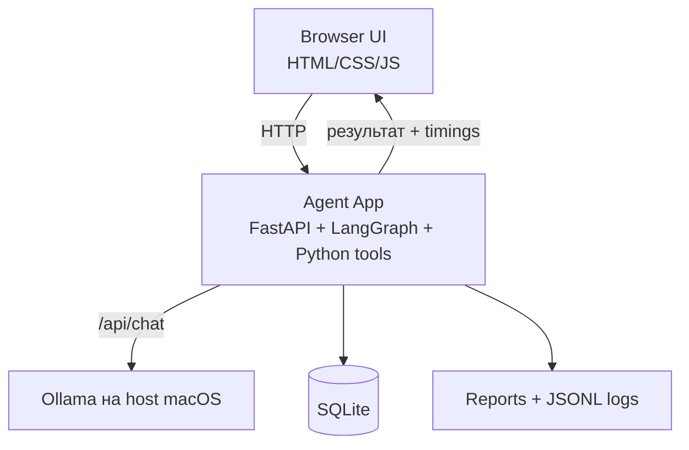
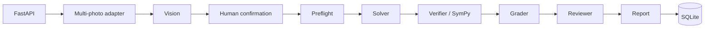
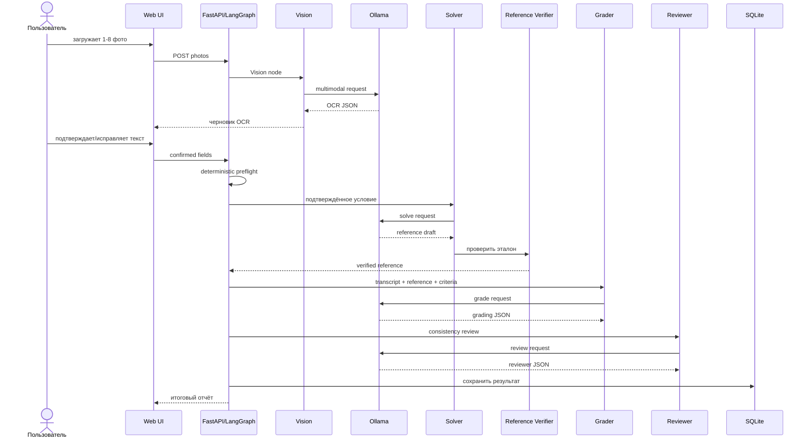

# MathCheck AI — ЕГЭ №13

Учебный проект локальной мультиагентной системы для предварительной проверки письменного решения задания ЕГЭ №13 по фотографии.

**Команда:** Артур Шарифуллин, Иван Филиппов.

Основной сценарий: **1–8 фото одной работы → Vision → подтверждение OCR человеком → preflight → Solver → Reference Verifier/SymPy → Grader → Reviewer → отчёт → сохранение результата**.

## Чек-лист по требованиям проекта

| Требование | Статус | Где реализовано |
|---|---|---|
| ТЗ на систему и границы MVP | ✅ | раздел «ТЗ и границы MVP» ниже |
| Выбор inference engine и обоснование | ✅ | Ollama, раздел «Выбор стека» |
| Сравнение вариантов изоляции | ✅ | venv / Docker / VM, раздел «Выбор стека» |
| Запуск в изолированной среде | ✅ | `Dockerfile`, `docker-compose.yml` |
| Open-source/local LLM | ✅ | Ollama + локальные модели |
| Проверка минимум трёх моделей | ✅ | `evals/run_model_selection.py`, Vision benchmark |
| Обоснование выбора основной модели | ✅ | раздел «Evals и выбор модели» |
| Agent framework | ✅ | LangGraph, `src/graph.py` |
| Мультиагентная архитектура | ✅ | Vision, Solver, Grader, Reviewer |
| Один управляемый flow | ✅ | `src/graph.py`, `ReviewState` |
| C4 | ✅ | раздел «C4» ниже |
| Sequence Diagram | ✅ | раздел «Sequence Diagram» ниже |
| System prompts | ✅ | `prompts/` |
| Skills отдельными файлами | ✅ | `skills/` |
| Семантические `.md` правила | ✅ | `knowledge/` |
| Tools | ✅ | `src/tools/` |
| Краткосрочная память | ✅ | `ReviewState`, `pending_store.py` |
| Долгосрочная память | ✅ | SQLite, `src/tools/core.py` |
| Сравнение вариантов advanced memory | ✅ | раздел «Память и RAG» |
| Обоснование отказа от classic RAG | ✅ | раздел «Память и RAG» |
| Evals LLM | ✅ | Vision benchmark, model selection |
| Evals всей agentic system | ✅ | `evals/run_ege13_benchmark.py` |
| Метрики качества | ✅ | accuracy, MAE, OCR similarity, latency и др. |
| Логи | ✅ | `llm_calls.jsonl` |
| Трейсы | ✅ | `traces.jsonl` |
| Алерты | ✅ | `alerts.jsonl`, `slow_llm_call` |
| Observability | ✅ | `src/observability/runtime.py` |
| Unit tests | ✅ | `tests/` |
| CI | ✅ | `.github/workflows/tests.yml` |
| Human-in-the-loop | ✅ | обязательное подтверждение OCR перед Solver |
| История проверок | ✅ | SQLite persistence |

## ТЗ и границы MVP

Основной пользователь — преподаватель или проверяющий. На вход поступают тип задания `ege_13`, `review_id`, `student_id` и от одной до восьми фотографий одной работы.

После Vision пользователь подтверждает три поля:

- условие (`confirmed_task_equation`);
- интервал пункта б (`confirmed_interval`);
- полный текст решения ученика (`confirmed_transcript`).

До этого момента математическая проверка не запускается.

На выходе система возвращает балл 0–2, результат по пунктам а и б, найденные ошибки, правильный ответ, короткий комментарий, флаг ручной проверки и время основных этапов.

Ограничения текущего MVP:

- поддерживается только ЕГЭ №13;
- OCR с фотографии всегда подтверждает человек;
- нарисованная учеником тригонометрическая окружность не влияет на score;
- пункт б проверяется по подтверждённой записи выбранных корней;
- результат является предварительной проверкой, а не официальным экспертным заключением.

## Основной flow



Если загружено несколько фотографий, сервер собирает их в один упорядоченный лист и делает один Vision-вызов. После Vision flow останавливается и ждёт подтверждения пользователя. Preflight отсекает сломанные скобки, неоднозначную запись, некорректный интервал и другие очевидные проблемы до запуска Solver.

## Агенты

В runtime используются четыре LLM-агента.

| Агент | Что делает |
|---|---|
| **Vision** | Читает фото и создаёт черновую транскрипцию. Не оценивает работу и не исправляет математику ученика. |
| **Solver** | Решает подтверждённое условие независимо от ответа ученика и строит эталон. |
| **Grader** | Сравнивает подтверждённое решение с проверенным эталоном и критериями №13. |
| **Reviewer** | Проверяет непротиворечивость итогового результата и может добавить замечание, но не подменяет детерминированный score. |

`Reference Verifier` не является пятым агентом. Это детерминированный компонент на правилах и SymPy.

Кроме него отдельно работают preflight, parser школьной записи, проверка семейств корней, проверка корней на интервале, rubric score, report builder, renderer окружности и SQLite persistence.

Общее состояние одной проверки хранится в `ReviewState` и передаётся между узлами LangGraph.

## C4

### Level 1 — System Context



MathCheck работает локально. В основном сценарии фотографии и текст работы не отправляются во внешний облачный LLM API.

### Level 2 — Containers



Agent App можно запускать в `venv` или Docker. Для сдаваемого варианта приложение работает в Docker, а Ollama остаётся на macOS, чтобы использовать локальное ускорение без отдельной настройки GPU внутри контейнера.

### Level 3 — Components



## Sequence Diagram



## Почему LangGraph

Для проекта нужен фиксированный и проверяемый порядок этапов с остановкой на подтверждение OCR. Поэтому выбрали LangGraph.

| Вариант | Плюс | Почему не выбрали |
|---|---|---|
| **LangGraph** | явный state, nodes, conditional edges, human gate | выбран |
| CrewAI | удобно описывать роли команды агентов | меньше контроля над точным flow |
| AutoGen | гибкие диалоги между агентами | для последовательной проверки избыточен |
| свой оркестратор | полный контроль | пришлось бы писать и поддерживать больше служебного кода |

Supervisor Agent отдельно не нужен: последовательность известна заранее, а маршрутизация описана в `src/graph.py`.

## Выбор стека

### Inference engine

| Вариант | Что получили | Решение |
|---|---|---|
| **Ollama** | простой локальный сервер, API, Vision-модели, быстрое переключение моделей | выбран |
| llama.cpp | больше низкоуровневого контроля и настроек квантования | для MVP требует больше ручной настройки |
| vLLM | хороший throughput и batching | полезнее для серверной нагрузки, чем для одного локального Mac |

Основная модель — `qwen3-vl:4b-instruct`.

### Изоляция

| Вариант | Использование |
|---|---|
| `venv` | удобно для локальной разработки |
| **Docker** | выбран для воспроизводимого запуска приложения |
| VM / microVM / sandbox | сильнее изоляция, но для проекта без запуска произвольного пользовательского кода это лишняя сложность |

Основной стек: Python 3.12, FastAPI, LangGraph, Ollama, SymPy, SQLite, Docker.

## Prompts, skills, knowledge и tools

Мы разделили инструкции и программную логику по назначению:

- `prompts/` — базовая роль и формат ответа каждого агента;
- `skills/` — инструкции по конкретной задаче, например решение и проверка №13;
- `knowledge/` — постоянные правила проекта (`SOUL.md`, экспертные и formatting rules);
- `criteria/` — критерии и машиночитаемый rubric;
- `src/tools/` — детерминированная математика, parsers, scoring, отчёты и persistence.

Так правила можно менять и проверять отдельно от кода агентов.

## Память и RAG

В проекте разделены три типа данных.

1. **Одна текущая проверка** — `ReviewState`. После Vision незавершённая проверка дополнительно сохраняется через `pending_store.py`, чтобы продолжить её после подтверждения.
2. **История ученика** — SQLite. По `student_id` можно получить предыдущие проверки, баллы, даты и статусы.
3. **Постоянные правила** — файлы `criteria/`, `skills/` и `knowledge/`, которые версионируются вместе с кодом.

Classic RAG не используется как основная память. Большая часть нужных запросов точная и структурированная: например, «последний балл ученика» лучше получать SQL-запросом, а не поиском похожего текста по embeddings. Критерии №13 небольшие и заранее известны, поэтому отдельная vector database для них тоже не нужна.

Варианты, которые рассматривались:

| Подход | Где был бы полезен | Почему сейчас не нужен |
|---|---|---|
| **SQLite** | точные баллы, даты, статусы, история | выбран для MVP |
| Vector RAG | большой корпус неструктурированных текстов | точный SQL для истории надёжнее |
| Graphiti / LangMem | связи ошибок во времени, персональный контекст | пригодится при большом числе работ и тем |
| Mem0 / Letta / Zep | долговременная память диалоговых агентов | MathCheck не является долгим чат-ассистентом |
| LlamaIndex / PageIndex / RAGFlow | ingestion и поиск по большому набору документов | корпус проекта небольшой |
| Cognee / SuperMemory / memU | дополнительный semantic/graph memory слой | для текущего MVP лишняя инфраструктура |

Если проект расширится на много заданий и тысячи работ, можно оставить SQLite источником точных фактов, а сверху добавить semantic/graph слой для поиска повторяющихся ошибок.

## Evals и выбор модели

Ошибки Vision и ошибки дальнейшей математической проверки измеряются отдельно. После OCR в benchmark используется подтверждённая транскрипция — так проверка Solver/Verifier/Grader/Reviewer не смешивается с качеством распознавания фотографии.

Для eval подготовлен набор из 12 сбалансированных экспертных кейсов: 4 работы на 2 балла, 4 на 1 балл и 4 на 0 баллов. Финальный SYSTEM benchmark, для которого сохранены измеренные результаты, содержит 10 работ.

### SYSTEM benchmark

| Метрика | Результат |
|---|---:|
| Cases | 10 |
| Score accuracy | 0.90 |
| Mean absolute score error | 0.10 |
| Reference success rate | 1.00 |
| Manual review rate | 0.10 |
| Среднее машинное время | 166.97 с |

### Vision benchmark

| Модель | Прогон | Success | Valid JSON | OCR similarity |
|---|---:|---:|---:|---:|
| `qwen3-vl:4b-instruct` | 10/10 | 1.000 | 1.000 | 0.268 |
| `gemma3:4b` | 8 кейсов | 0.375 | 0.375 | 0.132* |
| `granite3.2-vision:2b` | 3 кейса | 0.333 | 0.333 | 0.008* |

`*` Для Gemma и Granite OCR similarity считалась только по успешным ответам.

Основной оставили `qwen3-vl:4b-instruct`: в нашем локальном прогоне она стабильно завершила все Vision-кейсы и вернула валидный structured JSON. При этом OCR similarity недостаточна, чтобы убирать human confirmation, поэтому подтверждение текста остаётся обязательным.

Запуск eval:

```bash
pip install -r requirements-eval.txt
python evals/prepare_ege13_images.py
python evals/run_ege13_benchmark.py
```

Экспертные данные берутся из `sources/ЕГЭ_13_критерии_решения_сканы.pdf`. Для Vision из страниц вырезается только область ученической рукописи: официальный ответ и экспертный балл не должны попадать модели. Локальные PNG для benchmark хранятся в `local_eval_data/` и не коммитятся в репозиторий.

Основные метрики: OCR similarity, human correction rate, score accuracy, MAE, reference success rate, manual review rate, latency по этапам, false error rate на экспертных 2 баллах и positive score rate на экспертных 0 баллах.

## Observability

В текущем варианте используются четыре части наблюдаемости:

- **logs** — `llm_calls.jsonl`: модель, агент, latency, tokens, done reason, timeout/error;
- **metrics** — timings этапов и агрегаты из сохранённых review;
- **traces** — `traces.jsonl`, где одна проверка связывается по `trace_id`/`review_id`;
- **alerts** — `alerts.jsonl`, включая `slow_llm_call` для медленных LLM-вызовов.

Реализация находится в `src/observability/runtime.py`. Порог медленного вызова задаётся `MATHCHECK_SLOW_AGENT_SECONDS`.

Сравнивали и готовые варианты:

| Вариант | Плюсы | Почему не выбрали сейчас |
|---|---|---|
| **локальный JSONL + SQLite** | просто, прозрачно, без внешнего сервиса | выбран |
| LangSmith | удобные traces и debugging LangChain/LangGraph | внешний сервис для локального MVP не обязателен |
| Langfuse | UI, traces, metrics, self-hosting | больше инфраструктуры |
| Langtrace / OpenTelemetry | стандартный tracing и интеграции | для текущего объёма достаточно локальных событий |

## Тесты и CI

Локально:

```bash
pytest -q
```

Перед релизом можно запустить:

```bash
bash release_check.sh
```

На `main` тесты также запускаются через `.github/workflows/tests.yml`.

Тесты отдельно покрывают агентов, task registry, preflight, reference verifier, scoring, source-lock, human confirmation, multi-photo flow, отчёт, observability и web UI.

## Структура проекта

```text
MathCheckAi/
├── src/
│   ├── agents/          # Vision, Solver, Grader, Reviewer и служебные nodes
│   ├── llm/             # Ollama client и config
│   ├── observability/   # traces/logs/alerts runtime
│   ├── tools/           # математика, parsers, rubric, report, persistence
│   ├── graph.py         # LangGraph flow
│   ├── state.py         # ReviewState
│   ├── api.py           # FastAPI
│   ├── multi_photo_api.py
│   └── task_registry.py
├── prompts/             # system prompts
├── skills/              # инструкции агентов
├── knowledge/           # постоянные правила
├── criteria/            # критерии №13
├── evals/               # benchmark и model selection
├── tests/               # unit/regression tests
├── sources/             # исходные экспертные материалы
├── web/                 # интерфейс
├── reports/             # локальные отчёты
├── Dockerfile
├── docker-compose.yml
├── requirements.txt
└── run.sh
```

## Запуск

### Локально на Mac

Первый запуск:

```bash
bash setup.sh
bash run.sh
```

После обновления:

```bash
bash update.sh
bash run.sh
```

Интерфейс: `http://127.0.0.1:8000/`  
Swagger: `http://127.0.0.1:8000/docs`

### Docker

Ollama остаётся запущенной на macOS, приложение поднимается в контейнере:

```bash
ollama pull qwen3-vl:4b-instruct
docker compose up --build
```

Контейнер подключается к Ollama через `host.docker.internal:11434`. SQLite, reports и observability вынесены в локальные volume-папки.

## Что можно улучшить дальше

Основные ограничения сейчас — скорость локального Vision и поддержка только одного типа задания. Следующие логичные шаги: оптимизировать Vision, добавить другие задания второй части и при большом объёме истории подключить semantic/graph memory поверх SQLite, не заменяя точное хранилище баллов и статусов.
