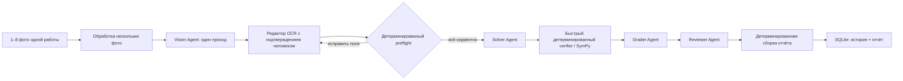

# MathCheck AI — архитектура ЕГЭ №13

## Основной поток выполнения

Если загружено одно изображение, Vision получает исходные байты файла без дополнительной переработки. Если страниц несколько, сервер собирает их в один упорядоченный лист и отправляет в Vision одним вызовом. Это позволяет не делать отдельный последовательный Vision-вызов для каждой страницы.

Математическая часть после подтверждения выполняется последовательно. Solver, Grader и Reviewer используют один локальный ускоритель, а результаты следующих этапов зависят от предыдущих. Human confirmation и детерминированный preflight обязательно выполняются до запуска Solver.

## Ответственность четырёх агентов

1. **Vision Agent** — делает один Vision-вызов и формирует черновик условия, текста решения ученика и служебные данные о качестве OCR. Он только распознаёт работу и не выставляет балл.
2. **Solver Agent** — получает подтверждённое условие и интервал и строит независимое эталонное решение. Решение ученика не используется им как основание для решения.
3. **Grader Agent** — получает подтверждённый текст ученика, проверенный эталон и критерии, после чего определяет ошибки и формирует результат оценивания. Факты о работе ученика берутся только из подтверждённого текста.
4. **Reviewer Agent** — выполняет итоговую проверку непротиворечивости результата Grader и детерминированно рассчитанного балла. Он может добавить предупреждение, но не должен незаметно заменять итоговый балл своим решением.

LangGraph передаёт общий `ReviewState` между узлами. Отдельный Supervisor Agent не используется, потому что маршрут проверки заранее известен и должен оставаться прозрачным.

## Граница доверия после подтверждения человеком

Результат Vision всегда считается черновиком. В браузере пользователь видит исходные фотографии и три редактируемых поля:

- `confirmed_task_equation`;
- `confirmed_interval`;
- `confirmed_transcript`.

Preflight проверяет подтверждённое уравнение, интервал и очевидные структурные ошибки OCR до любого вызова Solver, Grader или Reviewer. Если проверка не пройдена, пользователь остаётся в том же редакторе, исправляет данные и запускает проверку повторно.

После подтверждения источником истины становятся только эти поля. Интервал не восстанавливается из правильного ответа, а математика ученика не исправляется автоматически перед оцениванием.

## Детерминированные инструменты и узлы

Эти компоненты являются tools/nodes, а не дополнительными LLM-агентами:

- загрузчик профиля задания;
- preflight для задания №13;
- загрузчик критериев;
- парсеры выражений, семейств решений и корней;
- быстрый verifier на SymPy;
- извлечение фактов только из подтверждённого решения ученика;
- детерминированный расчёт балла по критериям №13;
- построение тригонометрической окружности;
- сборщик отчёта;
- сохранение проверки, истории и отчёта в SQLite.

## Правила выполнения и измерения времени

- Несколько страниц обрабатываются одним Vision-вызовом.
- Для одной страницы используются исходные байты; несколько страниц объединяются по порядку с ограничением ширины, чтобы не раздувать локальный Vision-вызов.
- Ollama использует потоковый NDJSON-ответ с отдельными ограничениями времени на подключение, простой и общий вызов.
- Частичный или оборванный JSON агента никогда не принимается как корректный ответ.
- Grader и Reviewer выполняются за один проход без скрытого цикла повторных запросов.
- Отдельно измеряется время Vision, preflight, Solver, verifier, Grader, Reviewer, сборки отчёта и сохранения.
- Solver, Grader и Reviewer запускаются только после human confirmation и успешного preflight.

## Правила надёжности для задания №13

- Неоднозначная OCR-запись вроде `sin x (x+π)` блокируется до Solver, пока пользователь явно не уточнит её смысл.
- Reference Verifier использует ограниченные и быстрые символьные преобразования вместо неограниченного полного вызова тригонометрического `solveset`.
- Варианты распознавания заголовка пункта б) (`б)`, `b)`, а также встречавшиеся `d)` и `6)`) нормализуются только для определения раздела; математическая запись ученика при этом не меняется.
- Явно записанные учеником корни пункта б) детерминированно сравниваются с проверенным набором корней на интервале.

## Сохранение данных и observability

- SQLite хранит данные проверок и историю.
- Локальные JSONL-файлы содержат telemetry LLM-вызовов и события о слишком долгих запросах.
- В интерфейсе показывается время каждого этапа текущей проверки.
- Для отчёта также сохраняются traces и metrics, при этом JSONL остаётся независимым локальным источником событий.

## Диаграммы ученика

Проверка нарисованной учеником тригонометрической окружности не входит в активный runtime MVP, потому что потребовала бы ещё одного дорогого Vision-вызова. При этом итоговый отчёт может построить детерминированную эталонную окружность по уже проверенному ответу.

См. также `docs/C4.md` и `docs/sequence.mmd`.
