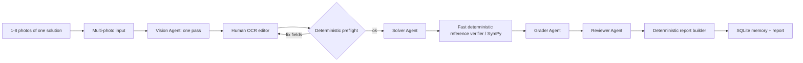

# MathCheck AI — ЕГЭ №13 architecture

## Runtime flow

For one image Vision receives the original uploaded bytes. For several images the server builds one ordered page sheet and sends it to Vision in one model call. This avoids N sequential Vision calls for an N-page solution.

The mathematical grading tail is intentionally sequential on the local Mac because Solver, Grader and Reviewer share one local accelerator. Human confirmation and deterministic preflight happen before Solver is allowed to run.

## Four agent responsibilities

1. **Vision Agent** — one Vision call -> draft task text/student transcript + OCR uncertainty metadata. It transcribes and does not grade the student.
2. **Solver Agent** — confirmed task equation + interval -> independent reference solution. It never receives the student's solution as solving evidence.
3. **Grader Agent** — confirmed student transcript + verified reference + criteria -> error classification and draft score. Student evidence is source-locked to the confirmed transcript.
4. **Reviewer Agent** — one-pass consistency audit of the deterministic score and Grader output. It may add an advisory but cannot silently replace the deterministic score.

LangGraph carries the shared `ReviewState`. A separate Supervisor Agent is intentionally not used because the flow is fixed and auditable.

## Human-confirmed source boundary

Vision output is always a draft. The browser displays the source photo(s) and three editable fields:

- `confirmed_task_equation`;
- `confirmed_interval`;
- `confirmed_transcript`.

The preflight validates the confirmed equation/interval and obvious OCR-structure problems before any Solver/Grader/Reviewer call. If preflight fails, the user remains in the same editor, corrects the field and checks again.

After confirmation, the source of truth is exactly those confirmed fields. The interval is never reconstructed from the correct answer and the student's mathematics is never auto-corrected before grading.

## Deterministic tools / nodes

These are tools/nodes, not additional agents:

- task profile loader;
- EGE-13 input preflight;
- criteria loader;
- expression/family/root parsers;
- fast SymPy reference verifier;
- source-locked student evidence extractor;
- deterministic EGE-13 rubric score;
- trig-circle renderer;
- report builder;
- SQLite review/history/report persistence.

## Runtime / latency rules

- Multiple pages are processed in one Vision call.
- One-page input keeps original bytes; multi-page input is stitched in page order with bounded width for reasonable local Vision latency.
- Ollama transport uses NDJSON streaming with separate connect, idle and emergency total deadlines.
- Partial/truncated agent JSON is never accepted as a valid response.
- Grader and Reviewer are single-pass: no hidden retry loop.
- A progress store measures Vision, preflight, Solver, reference verification, Grader, Reviewer, report building and persistence separately.
- Solver/Grader/Reviewer start only after human confirmation and successful preflight.

## Reliability rules for №13

- Ambiguous OCR such as `sin x (x+π)` is blocked before Solver until the human makes the meaning explicit.
- The reference verifier uses bounded/fast symbolic transformations instead of an unrestricted full trigonometric `solveset` call.
- OCR variants of the heading for part б (`б)`, `b)`, observed `d)`/`6)`) are normalized only for section detection; the student's mathematical content is preserved.
- Explicit final roots from part б are checked deterministically against verified interval roots.

## Persistence and observability

- SQLite stores review/history data.
- Local JSONL records LLM telemetry and slow-call alerts.
- Browser UI shows per-stage elapsed time during a review.
- The final observability stage adds a trace/metrics layer for the academic report while keeping JSON logs as an independent local source.

## Diagrams

Student-drawn diagram verification is outside the runtime MVP because it adds another expensive Vision pass. The final report can still render a deterministic, mathematically verified reference trigonometric circle from the verified answer.

See also `docs/C4.md` and `docs/sequence.mmd`.
