# MathCheck AI — Stage 2.9.7.8 architecture

## Runtime flow

```mermaid
flowchart LR
    A[Upload one photo: task + solution] --> P[Task Profile]
    P --> V[Vision Agent]
    V --> H[Human confirmation of task + solution]
    H --> S[Solver Agent]
    S --> R[Deterministic Reference Verifier / SymPy]
    R --> G[Grader Agent]
    G --> Q[Reviewer Agent]
    Q --> B[Deterministic Report Builder]
    B --> M[SQLite memory + saved report]
```

The product flow is intentionally sequential on the local Mac. Human confirmation happens before any mathematical grading.

## Four agent responsibilities

1. **Vision Agent** — one photo -> draft task statement + draft student transcript + OCR uncertainty metadata. It does not solve or correct either text.
2. **Solver Agent** — confirmed task statement -> independent machine-first solution. It never sees the student's answer.
3. **Grader Agent** — confirmed student transcript + verified reference + criteria -> compact error classification/audit. Student evidence is source-locked to the confirmed transcript.
4. **Reviewer Agent** — one-pass consistency audit of the deterministic score, Grader output and criteria. It cannot replace the student's evidence or silently rewrite the score.

LangGraph carries the shared `ReviewState`. A separate Supervisor Agent is intentionally not used.

## Human-confirmed source boundary

Vision output is never authoritative. The browser shows the original image beside two editable fields:

- `confirmed_task_statement`
- `confirmed_transcript`

Only after the user confirms both does the post-confirmation graph run. The authoritative task input for Solver/reference verification is the confirmed task statement. The authoritative student evidence for grading is the confirmed transcript.

If the task statement is not visible in the photo, the task field stays empty and the human can type it manually on the confirmation screen. This does not trigger a second Vision call.

## Deterministic tools / nodes

These are not counted as agents:

- `load_criteria`
- `verify_expression`
- `verify_roots`
- `verify_ege13_reference` / SymPy correction
- deterministic student-evidence extractor / source lock
- deterministic rubric score
- `render_trig_circle`
- report builder
- `save_review` / `load_student_history` / `save_report`

## Runtime / latency rules

- Only Vision receives the image.
- Original PNG/JPEG/WEBP bytes are sent to Vision; no resize/recompression.
- Vision has no application-level `num_predict` cap.
- Ollama transport is NDJSON streaming with connect timeout, idle timeout, and a high emergency total ceiling.
- Grader and Reviewer are single-pass: no automatic retry call.
- Grader/Reviewer do not have the old small custom output caps that could truncate JSON.
- Solver, Grader and Reviewer run only after human confirmation of both task and solution.

## Diagram scope

Student diagram OCR remains disabled in the runtime MVP for latency. The final report can still contain a deterministic, mathematically verified reference trig circle rendered from the verified reference answer.
