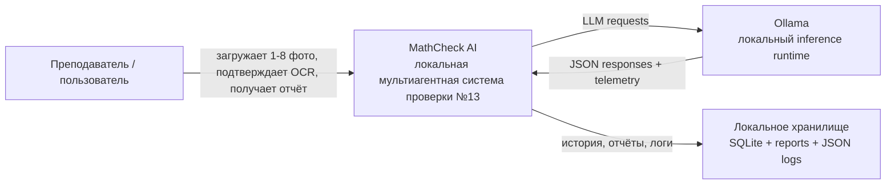
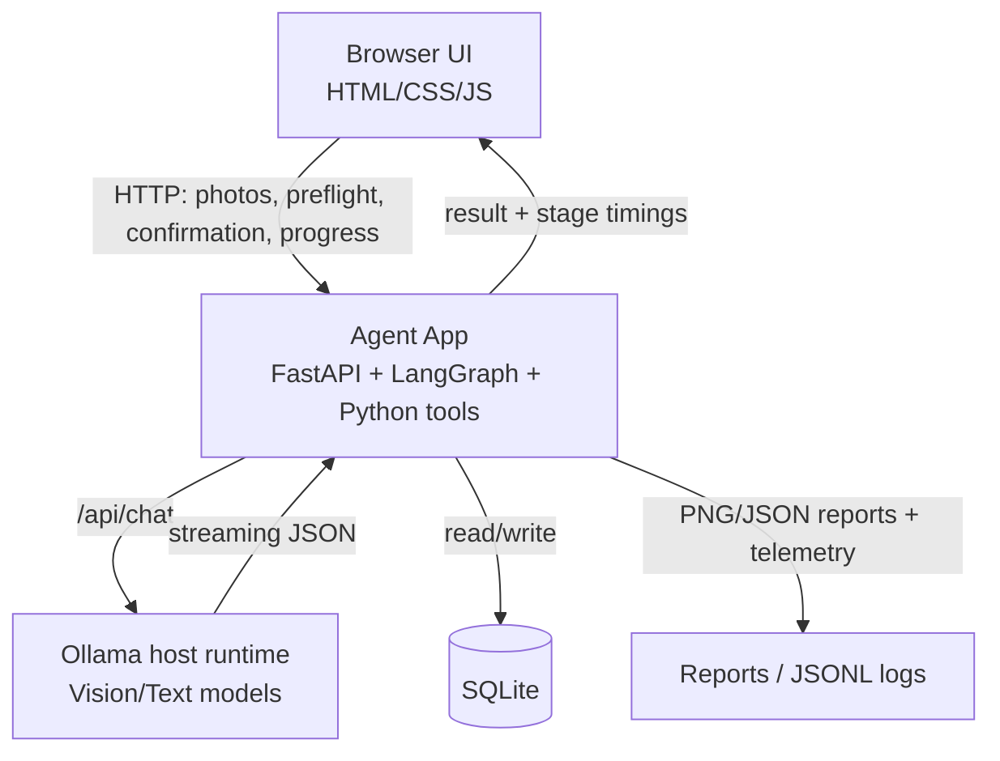
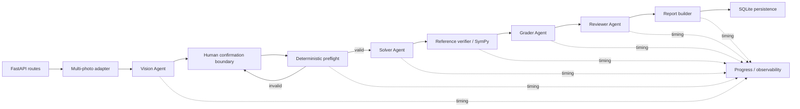

# C4 — MathCheck AI, ЕГЭ №13

Ниже три уровня C4 для текущего MVP. Диаграммы сделаны обычным Mermaid flowchart, чтобы они стабильно отображались в GitHub и легко вставлялись в итоговый отчёт.

## C4 Level 1 — System Context

Граница системы: MathCheck AI не отправляет работу во внешний облачный LLM API в основном сценарии. Ollama работает локально на машине пользователя.

## C4 Level 2 — Containers

На macOS Agent App может работать либо в `venv`, либо в Docker. Ollama остаётся нативно на host, чтобы использовать локальное ускорение без GPU-проброса внутрь контейнера.

## C4 Level 3 — Components inside Agent App

### Почему это multi-agent, а не один большой prompt

- Vision отвечает только за чтение изображения.
- Solver строит независимый эталон и не оценивает ученика.
- Grader сравнивает подтверждённое решение с проверенным эталоном и критериями.
- Reviewer проверяет непротиворечивость уже рассчитанного результата.
- SymPy/preflight/report/persistence — детерминированные tools/components и не считаются дополнительными агентами.

Такое разделение позволяет показать отдельные prompts, skills, latency и ошибки каждого этапа на защите.
